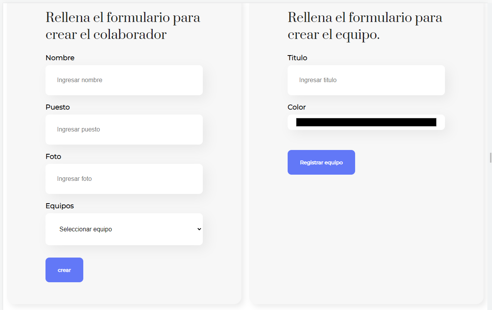

# React
Prácticas realizados de los diferentes cursos:

---

<h3 align="left">Práctica primeros pasos Alura Latan</h3>

 De clic al siguiente enlace para ver el repositorio, donde se explica el funcionamiento:
<a href="https://github.com/Hydr0bius/primera_app/tree/179747eef209fe437bf4633a8220f8f6c79c9851" target="blank">Link</a>

      